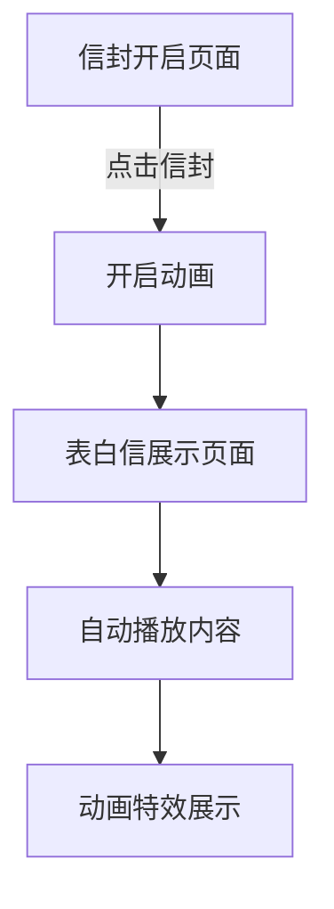

## 1. Product Overview
一个浪漫的在线表白网站，用户通过点击信封开启动画，浏览为宋青春定制的名人表白信内容，配合花瓣和爱心洒落的动画效果，营造浪漫氛围。

## 2. Core Features

### 2.1 User Roles
本网站为单用户展示型网站，无需用户注册和登录功能。

### 2.2 Feature Module
浪漫表白网站包含以下主要页面：
1. **信封开启页面**：展示精美信封，点击开启动画效果
2. **表白信展示页面**：自动播放表白信内容，配合浪漫动画效果

### 2.3 Page Details
| Page Name | Module Name | Feature description |
|-----------|-------------|---------------------|
| 信封开启页面 | 信封展示模块 | 显示精美信封，支持点击交互，触发开启动画 |
| 信封开启页面 | 开启动画模块 | 信封打开动画效果，平滑过渡到信纸展示 |
| 表白信展示页面 | 信纸展示模块 | 展示精美的信纸背景和排版 |
| 表白信展示页面 | 内容播放模块 | 自动逐行或逐段显示表白信内容 |
| 表白信展示页面 | 动画特效模块 | 花瓣和爱心洒落动画，营造浪漫氛围 |
| 表白信展示页面 | 背景音乐模块 | 可选的浪漫背景音乐播放 |

## 3. Core Process
用户操作流程：
1. 用户进入网站首页，看到精美的信封展示
2. 用户点击信封，触发开启动画
3. 信封打开后，自动跳转到表白信展示页面
4. 表白信内容自动播放显示，同时播放花瓣和爱心洒落动画
5. 用户可静静欣赏完整的表白信内容

## 4. User Interface Design

### 4.1 Design Style
- **主色调**：粉色、红色、白色（浪漫配色）
- **按钮样式**：圆润柔和的设计风格
- **字体**：优雅的手写体或衬线字体
- **布局风格**：居中对称布局，突出浪漫氛围
- **动画风格**：平滑过渡，花瓣和爱心自然飘落

### 4.2 Page Design Overview
| Page Name | Module Name | UI Elements |
|-----------|-------------|-------------|
| 信封开启页面 | 信封展示 | 粉色系渐变背景，中央放置精美信封，信封带有丝带装饰，悬停时有微光效果 |
| 表白信展示页面 | 信纸背景 | 米白色信纸纹理背景，边框装饰花纹，整体居中对齐 |
| 表白信展示页面 | 内容展示 | 深灰色优雅字体，行间距适中，文字逐行淡入效果 |
| 表白信展示页面 | 动画特效 | 粉色花瓣和红色爱心从顶部随机位置飘落，透明度渐变 |

### 4.3 Responsiveness
采用桌面优先设计，同时适配移动设备，确保在不同屏幕尺寸下都能良好展示浪漫效果。