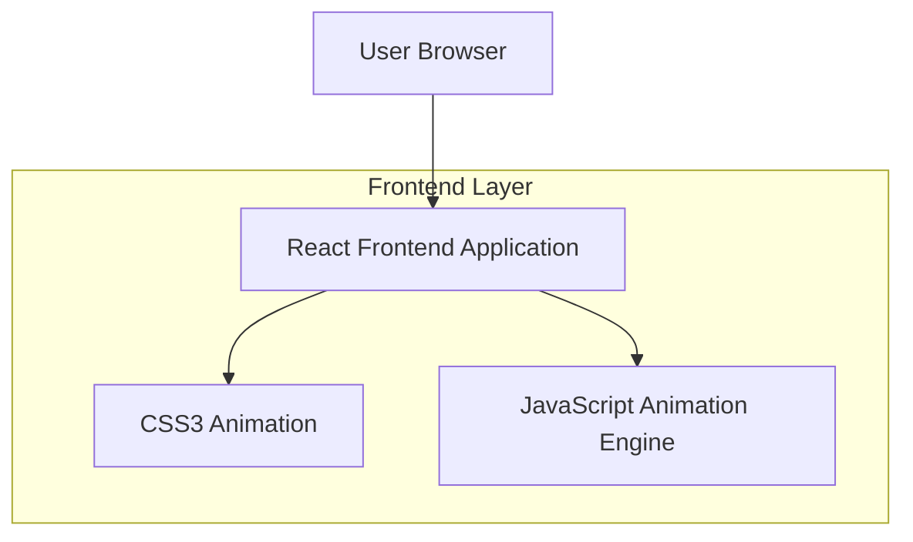

## 1.Architecture design

## 2.Technology Description
- Frontend: React@18 + Vite@4 + TailwindCSS@3
- Animation: CSS3 Animation + JavaScript Animation Engine
- Build Tool: Vite
- Deployment: Static hosting (Vercel/Netlify)

## 3.Route definitions
| Route | Purpose |
|-------|---------|
| / | 信封开启页面，展示信封和开启动画 |
| /letter | 表白信展示页面，显示内容和动画特效 |

## 4.Server architecture diagram
本项目为纯前端静态网站，无需后端服务架构。

## 5.Implementation Details

### 5.1 动画效果实现
- **信封开启动画**：使用CSS3 transform和transition实现信封打开效果
- **花瓣飘落动画**：使用JavaScript动态创建DOM元素，配合CSS动画实现随机飘落
- **爱心洒落动画**：SVG爱心图标配合CSS动画实现洒落效果
- **文字播放动画**：使用JavaScript定时器逐行显示文字内容

### 5.2 响应式设计
- 使用TailwindCSS的响应式类名适配不同屏幕尺寸
- 移动端优化触摸交互体验
- 确保动画效果在各种设备上流畅运行

### 5.3 性能优化
- 使用CSS硬件加速优化动画性能
- 图片资源压缩和懒加载
- 动画元素池化复用减少DOM操作